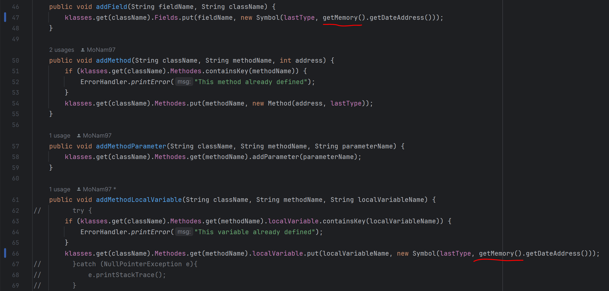

# گزارش آزمایش ششم
### بازآرایی کد (Code Refactoring)

  
  

محمد نامدار  ـــــ  حمیدرضا دهباشی

## گزارش پروژه

#### بازآرایی state

در اینجا با ایجاد کلاس State و ارث بری shift, accept و reduce، بجای switch case موجود در toString() کلاس Action از actionState.GetString(number) استفاده می کنیم. همچنین در State نیز act مورد نظر را نگهداری میکنیم. به اینصورت به ازای هر یک از State های مورد نظر شامل accept, shift, reduce تابع GetString() مختص به خودشان را اجرا میکنند و به اینصورت این بازآرایی صورت گرفته است.

#### بازآرایی Separate Query From Modifier

در تابع مشخص شده در کامیت، چندین عملیات صورت گرفته تقسیم بندی شده اند و در توابع متفاوت set و get به صورت جداگانه گرفته است.

#### بازآرایی Facade 1

ابتدا pareserController را پیاده سازی کردیم. هدف از این کلاس در حقیقت کنترل و هندل کردن اتفاقات میان کلاس های متفاوت از جمله parser، CodeGenerator و lexicalAnalyzer است. در حقیقت parserController به عنوان یک کلاس facade ارتباطات و کنترل های میان این کلاس ها را انجام می دهد.

#### بازآرایی Facade 2

در گام بعدی، InsideParserController را پیاده سازی کردیم. در حقیقت این کلاس یک کلاس محدودتری است که رابطه میان اجزای کلاس parser را کنترل و مدیریت میکند به صورتیکه تنها stack و عملیات های حول آن در کلاس parser پیاده سازی می شود. این کلاس شامل parserTable و Rule ها می باشد.

####  بازآرایی self encapsulate field

در کلاس SymbolTable از متد getter برای دسترسی به متغیر private mem استفاده کردیم.

#### بازآرایی encaplulate field

متغیر عمومی hasError را در کلاس ErrorHandler به private تغییر دادیم و getter و setter آن را پیاده سازی کردیم.

#### بازآرایی utility class

با توحه به اینکه همه ی متدها و ویژگی های کلاسstatic ،ErrorHandler  هستند، این کلاس را به صورت یک کلاس utility پیاده سازی کردیم
تا به این صورت امکان ایجاد نمونه از این کلاس وجود نداشته باشد.

## پاسخ به سوالات

### پاسخ سوال 1.
 - کد تمیز(Clean Code):
  کد تمیز، کدی است که خواندن و درک آن آسان است
  و همچنین ساختار مناسب داشته و به سادگی قابل نگهداری است. در چنین کدی توجه جدی بر خوانایی، سادگی و کارایی وجود دارد.
 - بدهی فنی(Technical Debt):
 بدهی فنی به هزینه یا پیامد ضمنی انتخاب یک راه حل غیربهینه در توسعه نرم افزار اشاره دارد. 
 این معیار کار یا هزینه اضافی را نشان می‌دهد که انتخاب میانبرها یا راه‌حل‌های سریع برای دستیابی به اهداف فوری، برای نگهداری بلند مدت پروژه ایجاد می کند.
 - بوی بد(Bad Smells):
  علائم و نشانه هایی در کد هستند که ممکن است از مشکلات جدی تری در طراحی یا ساختار معماری کد خبر بدهند. به طور کلی بوی بد هشداری به توسعه دهندگان است تا با بازآرایی کد، کیفیت و قابلیت نگهداری پروژه را بهبود دهند.

### پاسخ سوال 2.

- چاق ها(Bloaters):
کدها، متدها و کلاس‌هایی که به اندازه‌های بزرگی افزایش یافته‌اند و کار کردن با آنها سخت است. معمولاً این بوها فوراً ظاهر نمی شوند، بلکه در طول زمان و با تکامل برنامه به وجود می آیند.
- سوء استفاده کنندگان از شی گرائی(Object-Orientation Abusers):
این علائم کاربرد های غلط یا ناقص از اصول شی گرایی اند.
- پیشگیری کننده ها از تغییر(Change Preventers):
این علائم نشاندهنده این موضوع اند که تغییر در یک قسمت کد، نیاز به تغییر در بخش های زیاد دیگری را به وجود می آورد که نتیجتا توسعه برنامه را پیچیده تر و پر هزینه تر می 
کند.
- دور ریختنی ها(Dispensables):
این ها موارد غیر ضروری در کد هستند که حذفشان کد را تمیز تر کرده و فهم و کارکرد آن را بهبود می بخشد.
- وابسته کننده ها(Couplers):
علائم این گروه به وابستگی بیش از حد بین کلاس ها کمک می کند .
<!-- یا نشان می دهد که اگر جفت با تفویض بیش از حد جایگزین شود چه اتفاقی می افتد. -->

### پاسخ سوال 3.

بد بو Lazy Class در دسته Dispensables
 ها قرار دارد.

برای رفع آن میتوان از تکنیک بازآرایی‌ 
Inline Class
یا Collapse Hierarchy
 استفاده کرد.

 گاهی اوقات یک Lazy Class
  به منظور ترسیم اهداف توسعه در آینده ایجاد می شود، 
  در این موارد میتوان از این بد بو چشم پوشی کرد؛ البته باید سعی کنیم تعادل بین وضوح و سادگی را در کد حفظ کنیم.

